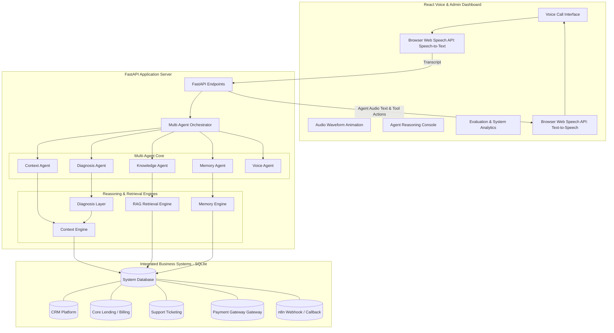

# CredResolve Borrower Support AI Voice Agent System

An agentic, multi-system integrated inbound voice agent system designed for borrower support servicing. 
This solution aggregates loan profiles, ledger records, support tickets, payment failures, and continuous memories into a single dashboard. It features an interactive voice call simulator in the browser, powered by real-time speech synthesis (TTS) and speech recognition (STT), backed by a FastAPI backend utilizing vector policy RAG and diagnosis heuristics.

---

## 🛠️ System Architecture



---

## 📂 Project Structure

```text
borrower_voice_agent/
│
├── backend/                       # Python FastAPI Backend
│   ├── database.db                # SQLite database (Auto-generated)
│   ├── database.py                # Database connection & CRUD operations
│   ├── generate_data.py           # Programmatic synthetic data seeder (100+ borrowers, 500+ payments)
│   ├── context_engine.py          # Unified context aggregator
│   ├── diagnosis_layer.py         # Knowns / gaps analyzer & agenda checklist
│   ├── memory_engine.py           # Short and long-term memory logger
│   ├── rag_engine.py              # TF-IDF cosine-similarity policy search
│   ├── orchestrator.py            # Multi-agent orchestrator & tool execution router
│   ├── main.py                    # FastAPI web server and routes
│   └── test_scenarios.py          # E2E programmatic scenario runner
│
├── frontend/                      # React Frontend Dashboard
│   ├── src/
│   │   ├── App.jsx                # Voice console UI & speech interface
│   │   ├── App.css                # Premium dark glassmorphic stylesheet
│   │   ├── index.css              # Layout resets
│   │   └── main.jsx               # Entry-point
│   ├── package.json
│   └── vite.config.js
│
├── n8n_workflow_template.json     # Pre-configured n8n workflow file
└── README.md                      # Documentation
```

---

## ⚡ Deployment Instructions

### Prerequisites
- Python 3.9+
- Node.js 18+

---

### Step 1: Set Up & Seed the Backend

1. Navigate to the `backend/` directory:
   ```bash
   cd backend
   ```
2. Install the required Python packages:
   ```bash
   pip install fastapi uvicorn pydantic
   ```
   *Optional: If you wish to use the real Gemini API for dynamic LLM responses, install the SDK:*
   ```bash
   pip install google-generativeai python-dotenv
   ```
3. Initialize and seed the database with 100+ borrowers, 500+ payments, and 100+ transcripts:
   ```bash
   python generate_data.py
   ```
4. Start the FastAPI backend server:
   ```bash
   python main.py
   ```
   The backend will run on `http://127.0.0.1:8000`.

---

### Step 2: Set Up & Launch the Frontend Dashboard

1. Open a new terminal and navigate to the `frontend/` directory:
   ```bash
   cd frontend
   ```
2. Install the node packages:
   ```bash
   npm install
   ```
3. Start the Vite development server:
   ```bash
   npm run dev
   ```
4. Open the application in your browser:
   `http://localhost:5173/`

---

## 🤖 Memory & Continuous Learning Architecture

The system tracks borrower interactions across three distinct memory dimensions:
1. **Borrower Memory (Long-term)**: Saves the borrower's communication preferences, language choice, default reason tags, and active **Promise-to-Pay (PTP) commitments** (due date, committed amount, delay reason).
2. **Conversation Memory (Short-term)**: Feeds turn-by-turn context to the active LLM session.
3. **Agent Memory (Analytics & Feedback)**: Logs successful and unsuccessful interaction resolution paths (e.g. fee waivers completed, payment checkouts generated) to build a training history.

### Demonstration of Memory Evolution:
* **Call 1**: The borrower says, *"My salary is delayed. I will make the payment next Friday."* The agent parses this delay, updates the CRM tag, and logs a **Pending PTP** in the Memory table for the calculated date (e.g. `2026-06-12`).
* **Call 2**: When the borrower calls again, the Context Engine retrieves the pending promise. The agent bypasses generic greetings and initiates the call: *"Hello [Name]. During our previous conversation, you mentioned that you expected your salary on Friday and planned to make the EMI payment afterward. Were you able to complete the payment?"*

---

## 🔗 n8n Workflow Automation Integration

We provide a pre-built n8n template file `n8n_workflow_template.json` to configure real workflow automations.
1. Sign up/log in to a free account on [n8n.cloud](https://n8n.io/) or run n8n locally.
2. Create a new workflow, click the top-right menu, and select **Import from File**.
3. Select `n8n_workflow_template.json`.
4. Copy the webhook URL generated by the n8n **Webhook Listener** node.
5. Create a `backend/.env` file and paste the webhook URL:
   ```env
   WORKFLOW_WEBHOOK_URL=https://your-n8n-instance.com/webhook/credresolve-agent-webhook
   ```
6. When the agent triggers payment links, tickets, or callback schedules, n8n will process the trigger payload and automatically dispatch Telegram alerts, Slack notifications, or schedule Google Calendar events!

---

## 🧪 E2E Programmatic Test Runner

You can run automated E2E tests for the 6 demo scenarios directly via:
```bash
cd backend
python test_scenarios.py
```
This script programmatically validates that all context calculations, RAG retrieval score rankings, memory recalls, and tool dispatch logs complete successfully and match expected policy guidelines.
